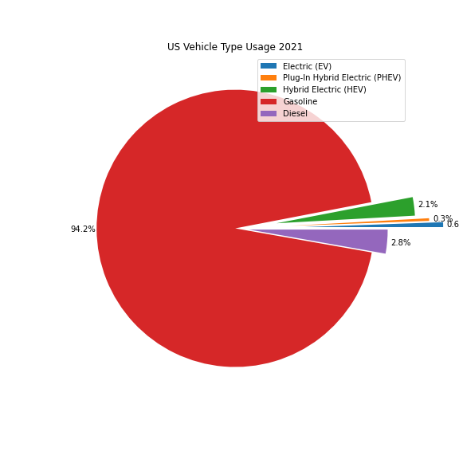
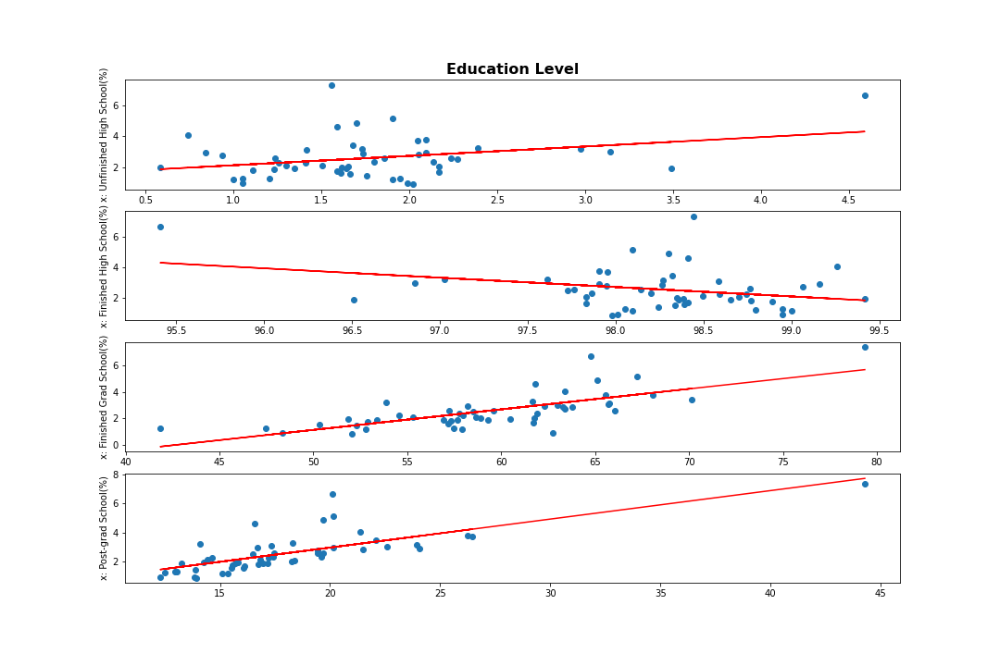
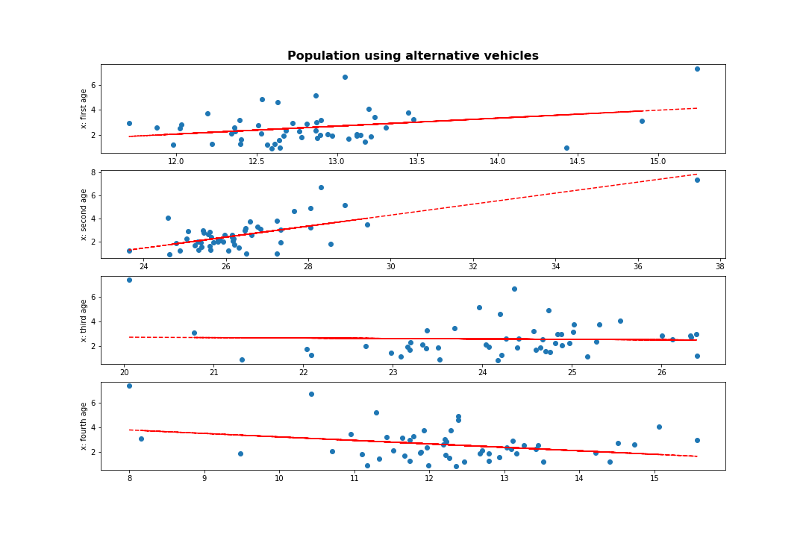

# HEV AND ELECTRIC CAR USAGE (PROJECT_EC)

## Collaborators 

* Marijose Cavazos
* Javier Robles
* Roberto Barron

## Project Description/Outline: 

Exhaustive research and analysis about electric and hybrid cars usage along the US comparing to different variables. 

# Questions: 

Main question: Which US State has a steeper tendency of hybrid and electric cars usage to be able to answer the question: What state would be more convinient to build an electric car dealership?

Is there a correlation between electric car buying and demographic characteristics of the population suchs as:
* education level
* mean income
* age?

Is there a correlation between electric car buying and political factors such as: 
* fuel state tax
* political preference
* state incentives?

Is there a correlation between electric car buying and charging stations availability?

## Datasets to be used: 

* Demographic information: [US CENSUS](www.census.gov)
* Vehicle Counts by State: [Vehicle Registration Counts by State](https://afdc.energy.gov/vehicle-registration)
* Charging Stations and law incentives: [US Department of Energy API](https://developer.nrel.gov/docs/transportation/)
* Gas prices: [U.S Energy Information Administration](https://www.eia.gov/petroleum/gasdiesel/)
* Gas tax by state: [IFEN tax by state](https://igentax.com/gas-tax-state-2/#___Gas_tax_by_state__)
* Presidential Elections since 1976: [Harvard Dataverse](https://dataverse.harvard.edu/dataset.xhtml?persistentId=doi:10.7910/DVN/42MVDX)

# Findings:

## Vehicle type analysis:

* Grouped Electric and Hybrid Electric vehicles into "Alternative vehicles"
* Grouped Diesel and Gasoline vehicles into "Fuel vehicles" 
* Measured state proportion of Alternative vehicles over Total vehicles.

### US vehicle type distribution pie chart:

**% of Alternative Vehicles Rate was used to find correlation with other factors.**

### Heatmap of Alternative vehicles (%) by state:

---

## Demographic Analysis

### Add Analysis!!!!!!!!!!!!!! para que lo necesito? en que me sirve? que podemos concluir de esto?

### Education 

#### Correlation:

* The correlation between'Unfinished High School (%)' and alternative car usage is 0.32 with a p-value of 0.02368063575363978
* The correlation between'Finished High School (%)' and alternative car usage is -0.32 with a p-value of 0.02368063575363965
* The correlation between'Finished Grad School (%)' and alternative car usage is 0.73 with a p-value of 9.178719718199633e-10
* The correlation between'Finished Post-grad School (%)' and alternative car usage is 0.74 with a p-value of 4.689613484272619e-10  

#### Heatmaps:

 
--- 
 
### Income per Capita

#### Correlation:

The correlation between Income Per Capita and Alternative Rate(%) is 0.73 with a p-value of 1.580506370637526e-09  

#### Anova:

F_onewayResult(statistic=8.11512860974485, pvalue=0.000920529748181304)  

#### Highest IpC:

The state with the highest income per capita is District of Columbia ($63793.00)  

#### Heatmap:

---

### Age

### Correlation:

* The correlation between'21-30 year olds' and alternative car usage is 0.31 with a p-value of 0.02508172069375031
* The correlation between '31-50 year olds' and alternative car usage is 0.69 with a p-value of 1.642038801736538e-08
* The correlation between '51-70 year olds' and alternative car usage is -0.04 with a p-value of 0.8025663158509312
* The correlation between '71+ year olds' and alternative car usage is -0.30 with a p-value of 0.02997162985336855  

### ANOVA : 

> Data limitations due to the privacy of dataset. There is no public data about who exactly is the owner of each car (no way to know the vehicle type by age). Though, we made a generalized analysis and had good findings despite the data limitations. 
>
>ANOVA isn't exact due to the lack of data but there was 85% certainty of difference between the groups.  

F_onewayResult(statistic=1.7810678055878766, pvalue=0.1520002662561829)  

---

## Political Analysis

### Historical Gas Prices in the US

****Constant upward trend on Gasoline Prices and this could be accelerating adoption of alternative vehicles.****
---
We can’t find a dataset with historical prices by state so we crossed Alternative rate vs Gas Tax by state but we found that are not correlated.

### Gas tax by state

#### Correlation:

* The correlation between Gasoline Tax / gallon and Alternative Rate(%) is 0.36 with a p-value of 0.010517503577449759  

---

### Political Party Preference

To find if there is correlation between Political preferences and % Alternative Rate we follow the next steps:
1)	Taking an historical dataset (1976-2020) of Presidential elections it can be determined the “political preference” of each state according to the % of wins of specific party.

#### T-Test:
2)	States with democrat preference has a higher mean but we ran a T-test and found that statistically there was a difference in the means.
Ttest_indResult(statistic=-5.036026493630137, pvalue=4.853783005218271e-05)

#### Correlation:
3)	Ran a correlation between states with democrat preference an % Alternative rate.

The correlation between Democrat Wins(%) and Alternative Rate(%) is 0.64 with a p-value of 4.1007651001537584e-07  

 Findings: states with democrat preferences and % alternative rate have a high level of predictivity.
---

### Laws and incentives per state

Crrelation analysis to found if there is correlation between states with higher incentives to own an alternative vehicle and we found those variables are highly predictivity among them.

#### Correlation:

The correlation between Total Incentives and Alternative Rate(%) is 0.65 with a p-value of 2.8704453970170873e-07  

#### Heatmap:

---

## Stations availability

### Total stations in a state

#### Correlation:

The correlation between Stations per vehicle and Alternative Rate(%) is 0.82 with a p-value of 1.7167868528303151e-13  

#### Heatmap:

---

### Where are the stations in:

# Results:

We first did the correlations to see which variables were found along with a higher percent of alternative vehicle usage. After we decided which variables to use as predictors (considered variables that had a correlation coefficient of >.60 only) we did a point based data frame in which we could summerize the ones that had more points by weighing the different variables and suming them to see which state would be the best decision to build a new alternative vehicle store. Our final findings were:

1) The highest correlated factors with % alternative rate in our analysis was % of grad and post grad school, a highest income per capita and Highest % of population of 31-50.

#### - District of columbia with a weighted total of 94.180727 points 
####  - Massachusetts with a weighted total 90.796292 points
####  - Washington  with a weighted total 87.621574 points

Using the found correlations, we weighted an average to rate the states (100 points max)  

# Conclusion:
From the data shown aboveand cosidering only the tendency of hybrids and electric car usage, we can conclude that the best state to open a new electric-car factory and/or warehouse would be 
    1.- DC
    2.- Massachusetts 
    3.- Washington
because they're the states with a steeper tendency. Though this results are not considering building or maintenance costs.

